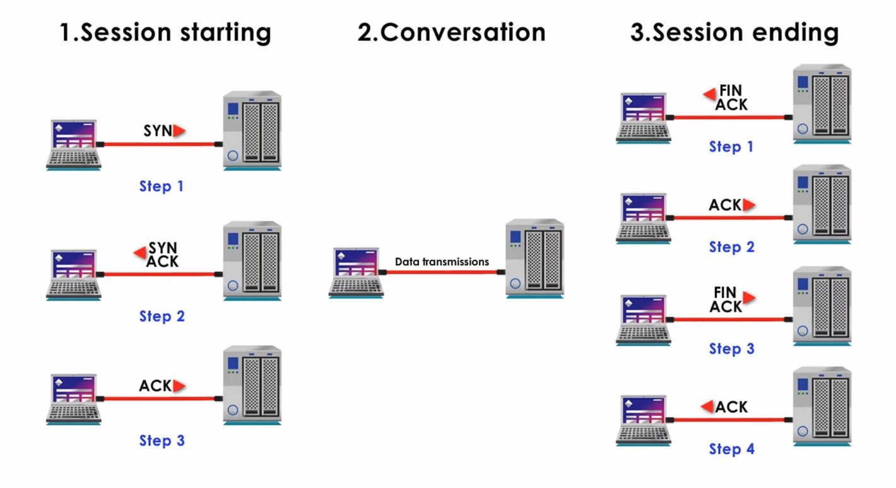

# Network Notes

## TCP Connection

- 三次握手：
1. 第一次握手：建立连接是，客户端发送SYN包到服务端，并进入syn_sent状态，等待服务器确认
2. 第二次握手：服务器收到SYN包，必须确认客户的SYN，同时自己也发送一个SYN包，即SYN+ACK包，此时服务器进入syn_ack状态
3. 第三次握手：客户端收到服务器的SYN+ACK包，向服务器发送确认包ACK，此包发送完毕，连接正式建立

- 四次挥手：
1. 客户端A发送一个FIN包，用来关闭客户A到服务器B的数据传送
2. 服务器B收到这个FIN，它发回一个ACK，确认序号为收到的序号加1，和SYN一样，一个FIN将占用一个序号
3. 服务器B决定关闭与客户端A的连接，发送一个FIN给客户端A
4. 客户端A发回ACK报文确认，并将确认号设置为收到序号加1

- TCP保证可靠的四项措施
1. 确认和重传机制：建立连接时三次握手同步双方的序列号确认号、窗口大小等信息，传输过程中，如果检验失败、丢包、延时则重传
2. 数据排序
3. 流量控制：维持一个滑动窗口来确保不会发生发送太快来不及接收的问题
4. 拥塞控制：慢启动，拥塞避免，快速重传，快速恢复

## TCP and UDP

1. tcp面向连接，udp是无连接的
2. tcp提供可靠的服务，udp尽最大努力交付
3. tcp是面向字节流的，tcp是把数据看成一连串的无结构的字节流，udp是面向报文的。Udp没有拥塞控制，适用于实时应用
4. 每条tcp连接只支持一对一，udp支持一对一，一对多，多对一，多对多
5. tcp首部开销20字节，udp只有8个字节
6. tcp建立起的是全双工的可靠信道，udp是不可靠的

## Http and Https

https的协议需要用到ca申请证书，因而需要一定的费用，http是超文本传输协议，信息是明文传输，https则是具有安全性的SSL加密传输协议，http的默认端口是80，https的默认端口是443， http的连接是简单的，无状态，https是有SSL+HTTP协议构建的可进行加密传输、身份认证的网络协议，比http协议安全

## Cookie and Session

Cookie是服务器在本地机器上存储的小段文本并随每一个请求发送至同一服务器。Cookies保存在客户端，主要内容包括：名字，值，过期时间，路径等等。

Session是在服务器端保存用户数据。服务器从请求中提取出Session ID，并和保存的所有Session ID进行对比，找到这个用户的信息。

区别：Cookie保存在客户端浏览器中，而Session保存在服务器上。Cookie机制是通过检查客户身上的“通行证”来确定客户身份的话，那么Session机制就是通过检查服务器上的“客户明细表”来确认客户身份。Session相当于程序在服务器上建立的一份客户档案，客户来访的时候只需要查询客户档案表就可以了。Cookie 在客户端（浏览器、易伪造、不安全），Session 在服务器端（会消耗服务器资源）

## 输入一个URL，接下来会发生什么

查询DNS，获取域名对应的IP->得到目标IP以及端口号后，调用socket，请求一个TCP流套接字，客户端向服务端发送HTTP请求报文（三次握手）->服务端通过五层，解析请求报文，发送http响应报文->关闭连接（四次挥手）->客户端解析响应报文，并在浏览器显示

