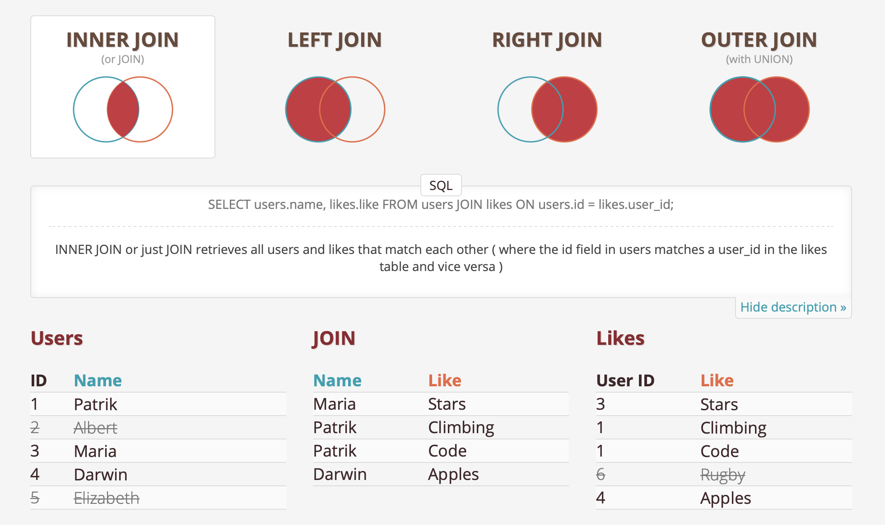
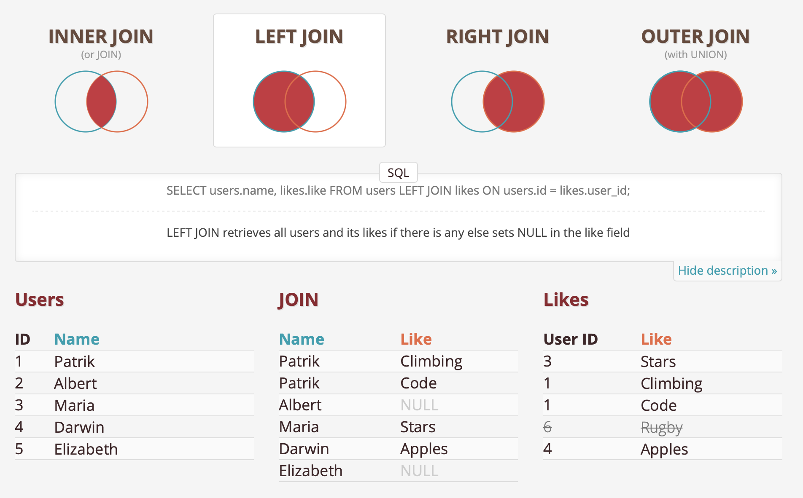
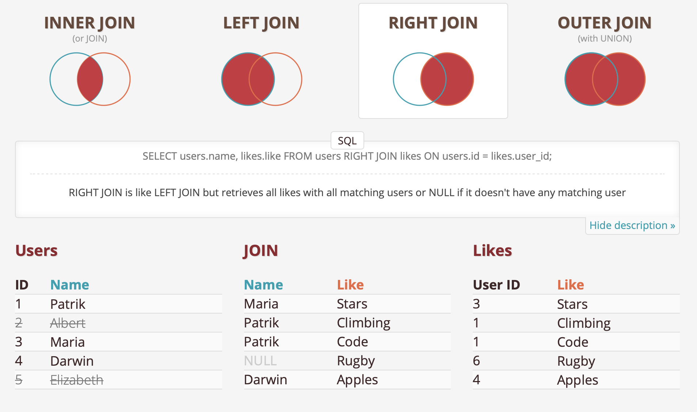
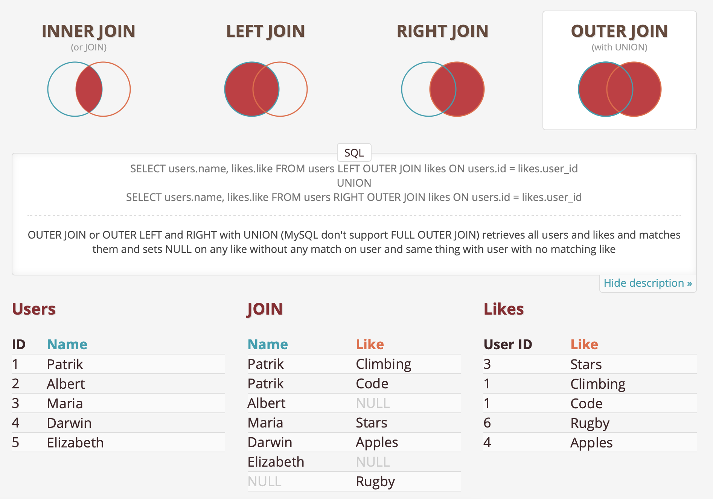

# Basics

## SELECT and WHERE
- The clauses always need to be in this order: `SELECT`, `FROM`, `WHERE`.

## LIMIT and OFFSET
- LIMIT: the #of lines of data wanted to get
- OFFSET: the #of lines of data wanted to skip

## Comparison Operators
- SQL uses **single quotes** to reference column values. If you're using an operator with values that are non-numeric, you need to put the value in single quotes: `'value'`.

Example #1: 
```mysql
SELECT *
  FROM tutorial.us_housing_units
 WHERE month_name > 'January'
```
The month_name will be words that list after 'January' in a real dictionary.

Example #2: 
```mysql
SELECT *
  FROM tutorial.us_housing_units
 WHERE month_name > 'january'
```
The month_name will be words that list after 'january' ('January' will be included!!) in a real dictionary.

Example #3: 
```mysql
SELECT *
  FROM tutorial.us_housing_units
 WHERE month_name > 'J'
```
The month_name will be words that list after letter 'J' ('January' will also be included!!) in a real dictionary.

- Arithmetic operating in `SELECT`: **Can only use for numeric values!**

Example #4:
```mysql
SELECT year,
       month,
       west,
       south,
       west + south - 4 * year AS nonsense_column
  FROM tutorial.us_housing_units
```

## LIKE
- Wildcard (`%`): represents any characters or set of characters.

Example #1:
```mysql
SELECT *
  FROM tutorial.billboard_top_100_year_end
 WHERE "group" LIKE 'Snoop%'
```
Since `GROUP` is the name of a function, we use double quote to indicate that the `"group"` is a column name in dataset

- A tip: `LIKE '%wantedword%'` can used for searching all rows where the wanted word is within it

- `LIKE` is **case-sensitive**. To ignore case, use `ILIKE`.

Example #2: 
```mysql
SELECT *
  FROM tutorial.billboard_top_100_year_end
 WHERE "group" ILIKE 'snoop%'
```

- Can also use single underscore - "\_", to substitute for a character.

Example #3: 
```mysql
SELECT *
  FROM tutorial.billboard_top_100_year_end
 WHERE "group" ILIKE 'dr_ke'
```

## IN
Example #1:
```mysql
SELECT *
  FROM tutorial.billboard_top_100_year_end
 WHERE year_rank IN (1, 2, 3)
```

Example #2:
```mysql
SELECT *
  FROM tutorial.billboard_top_100_year_end
 WHERE artist IN ('Taylor Swift', 'Usher', 'Ludacris')
```

## BETWEEN

The following codes have the same effect (`BETWEEN` is a closed interval):
```mysql
SELECT *
  FROM tutorial.billboard_top_100_year_end
 WHERE year_rank BETWEEN 5 AND 10
```

```mysql
SELECT *
  FROM tutorial.billboard_top_100_year_end
 WHERE year_rank >= 5 AND year_rank <= 10
```

## ORDER BY

- Default: ascending, if want descending, use `DESC`.

Example #1:
```mysql
SELECT *
  FROM tutorial.billboard_top_100_year_end
 WHERE year = 2013
 ORDER BY year_rank DESC
```
- Order by multiple columns: the `DESC` operator is only applied to the column that precedes it!

Example #2:
```mysql
-- year_rank ascending, year descending
SELECT *
  FROM tutorial.billboard_top_100_year_end
 WHERE year_rank <= 3
 ORDER BY year_rank, year DESC
```

- `ORDER BY` + `LIMIT`: ordering is executed first, then limit the result to a few rows

## DELETE

- Basics: delete some rows with specific conditions

```mysql
DELETE FROM Customers WHERE CustomerName='James'
```

- Delete all records in a table without deleting the table itself

```mysql
DELETE FROM Customers
```

# Intermediate

## Aggregate Functions

- `COUNT`, `SUM`, `MIN`, `MAX`, `AVG`

## COUNT
- Basics: `COUNT(1)` and `COUNT(*)` both return the number of rows of the table
```mysql
SELECT COUNT(*) FROM tutorial.aapl_historical_stock_price
-- is the same as 
SELECT COUNT(1) FROM tutorial.aapl_historical_stock_price
```

- Count an individual column
```mysql
SELECT COUNT(high) AS count_high
  FROM tutorial.aapl_historical_stock_price
```
This will return the # of **non-null** rows in "high"

## SUM (Only for numeric values)

Example #1: return the average
```mysql
SELECT SUM(open) / COUNT(open) AS avg_open
  FROM tutorial.aapl_historical_stock_price
```
The same effect as: (`AVG` will also ignore NULL values)
```mysql
SELECT AVG(open) AS avg_open
  FROM tutorial.aapl_historical_stock_price
```
## GROUP BY: separate data into groups, so that aggregation can be further applied

- Basics:

Example #1: count the number of entries for each year and month
```mysql
SELECT year,
       month,
       COUNT(*) AS count
  FROM tutorial.aapl_historical_stock_price
 GROUP BY year, month
```

- `GROUP BY` + `ORDER BY`

Example #2:
```mysql
SELECT year,
       month,
       SUM(volume) AS volume_sum
  FROM tutorial.aapl_historical_stock_price
 GROUP BY year, month
 ORDER BY year, month
```

Example #3: aggregate multiple functions
```mysql
SELECT year,
       month,
       MAX(high) AS max_val,
       MIN(low) AS min_val
   FROM tutorial.aapl_historical_stock_price
  GROUP BY year, month
  ORDER BY year, month
```

## HAVING: a clean way to filter an aggregated query

- `WHERE` does not filt for a condition comparison of aggregated columns (such as `MAX(high) > 400`), so we use `HAVING`:

```mysql
SELECT year,
       month,
       MAX(high) AS month_high
  FROM tutorial.aapl_historical_stock_price
 GROUP BY year, month
 -- select the rows with such conditions in an aggregated query
 HAVING MAX(high) > 400
 ORDER BY year, month
```

- Order of query clause so far: `SELECT`, `FROM`, `WHERE`, `GROUP BY`, `HAVING`, `ORDER BY`

## CASE: "if" statement

- Basics: `WHEN`, `THEN` and `END` (`ELSE` is optional)

```mysql
SELECT player_name,
       position,
       CASE WHEN position = 'WR' THEN 'yes'
            ELSE 'no' END AS is_wr
  FROM benn.college_football_players
```
The `CASE` statement will check whether the values in the "position" column is 'WR': if so, write 'yes' in "is_wr" column, if not, write 'no' in "is_wr" column

- Multiple conditions:

Example #1: categorize the weight, which is already a good approach (if-elif-else format)
```mysql
SELECT player_name,
       weight,
       CASE WHEN weight > 250 THEN 'over 250'
            WHEN weight > 200 THEN '201-250'
            WHEN weight > 175 THEN '176-200'
            ELSE '175 or under' END AS weight_group
  FROM benn.college_football_players
```
Example #2: same as before, but it creates no-overlapping (which may be confusing) categories
```mysql
SELECT player_name,
       weight,
       CASE WHEN weight > 250 THEN 'over 250'
            WHEN weight > 200 AND weight <= 250 THEN '201-250'
            WHEN weight > 175 AND weight <= 200 THEN '176-200'
            ELSE '175 or under' END AS weight_group
  FROM benn.college_football_players
```

- `CASE` with aggregate functions

Example #3: counting multiple conditions

```mysql
SELECT CASE WHEN year = 'FR' THEN 'FR'
            WHEN year = 'SO' THEN 'SO'
            WHEN year = 'JR' THEN 'JR'
            WHEN year = 'SR' THEN 'SR'
            ELSE 'No Year Data' END AS year_group,
            COUNT(1) AS count
  FROM benn.college_football_players
 GROUP BY year_group
```

To help with this procedure, can first write this block to show all columns in the data table as well as a column showing the results of `CASE` statement. Then, can replace `*` with an aggregation and add a `GROUP BY` clause.

```mysql
SELECT CASE WHEN year = 'FR' THEN 'FR'
            WHEN year = 'SO' THEN 'SO'
            WHEN year = 'JR' THEN 'JR'
            WHEN year = 'SR' THEN 'SR'
            ELSE 'No Year Data' END AS year_group,
            *
  FROM benn.college_football_players
```

Example #4: summing the weights of all FR/SO or JR/SR groups in California

```mysql
SELECT CASE WHEN year in ('FR', 'SO') THEN 'under'
            WHEN year in ('JR', 'SR') THEN 'upper'
            ELSE 'Other' END AS year_level,
            SUM(weight) as total_wright
  FROM benn.college_football_players
  WHERE state = 'CA'
  GROUP BY year_level
```

- `CASE` inside of aggregate functions

"Pivoting": instead of showing the data vertically in multiple rows, show the data horizontally in one row

This gives a vertical display:

```mysql
SELECT CASE WHEN year = 'FR' THEN 'FR'
            WHEN year = 'SO' THEN 'SO'
            WHEN year = 'JR' THEN 'JR'
            WHEN year = 'SR' THEN 'SR'
            ELSE 'No Year Data' END AS year_group,
            COUNT(1) AS count
  FROM benn.college_football_players
 GROUP BY year_group
```

This converts to horizontal display:

```mysql
SELECT COUNT(CASE WHEN year = 'FR' THEN 1 ELSE NULL END) AS fr_count,
       COUNT(CASE WHEN year = 'SO' THEN 1 ELSE NULL END) AS so_count,
       COUNT(CASE WHEN year = 'JR' THEN 1 ELSE NULL END) AS jr_count,
       COUNT(CASE WHEN year = 'SR' THEN 1 ELSE NULL END) AS sr_count
  FROM benn.college_football_players
```

## DISTINCT

- Select unique values from one column:

```mysql
SELECT DISTINCT month
  FROM tutorial.aapl_historical_stock_price
```

- Select all unique pairs of values in multiple columns:

```mysql
SELECT DISTINCT year, month
  FROM tutorial.aapl_historical_stock_price
```

- `DISTINCT` in aggregations

Example #1: count the unique values in `month` column

```mysql
SELECT COUNT(DISTINCT month) AS unique_months
  FROM tutorial.aapl_historical_stock_price
```

## SQL Aliases

```mysql
SELECT players.school_name,
       players.player_name,
       players.position,
       players.weight
  -- the table is aliased to "players"
  FROM benn.college_football_players players
 WHERE players.state = 'GA'
 ORDER BY players.weight DESC
```

## (INNER) JOIN: the intersection of two tables

- Basics:



```mysql
JOIN benn.college_football_teams teams
-- is the same as 
INNER JOIN benn.college_football_teams teams
```

Inner joins eliminate rows from both tables that do not satisfy the join condition set forth in the `ON` statement.

Example #1:

```mysql
SELECT teams.conference AS conference,
       AVG(players.weight) AS average_weight
  FROM benn.college_football_players players
  JOIN benn.college_football_teams teams
    ON teams.school_name = players.school_name
 GROUP BY teams.conference
 ORDER BY AVG(players.weight) DESC
```

If a player goes to a school that is not in `teams` table, then the player will not be included in the resulted table; if there are schools in the teams table that do not match any school in the `players` table, those rows will not be included in the resulted table either.

- `JOIN` and `ON`

```mysql
ON teams.school_name = players.school_name
```

Joins all rows from the `players` table on to rows in the `teams` table for which the `school_name` field in the `players` table is equal to the `school_name` field in the `teams` table.

- Helper methods:

Example #2: see all columns of both tables returned by `JOIN`

```mysql
SELECT *
  FROM benn.college_football_players players
  JOIN benn.college_football_teams teams
    ON teams.school_name = players.school_name
```

Example #3: only see columns from `players` table

```mysql
SELECT players.*
  FROM benn.college_football_players players
  JOIN benn.college_football_teams teams
    ON teams.school_name = players.school_name
```

## Outer Joins

- `LEFT JOIN` returns only unmatched rows from the left table (all entries in the left table will be kept in the result).
- `RIGHT JOIN` returns only unmatched rows from the right table (all entries in the right table will be kept in the result).
- `FULL OUTER JOIN` returns unmatched rows from both tables (similar to union).

## LEFT (OUTER) JOIN

- Basics:



```mysql
SELECT companies.permalink AS companies_permalink,
       companies.name AS companies_name,
       acquisitions.company_permalink AS acquisitions_permalink,
       acquisitions.acquired_at AS acquired_date
  FROM tutorial.crunchbase_companies companies
  LEFT JOIN tutorial.crunchbase_acquisitions acquisitions
    ON companies.permalink = acquisitions.company_permalink
```

It will tell the database to return all rows in the table in the `FROM` clause, **regardeless of whether** they have matches in the table in the `LEFT JOIN` clause.

- The conditions in `ON` will do the filtering **before** the join occurs (i.e., an evaluation on a single table), but the conditions in `WHERE` will do the filtering **after** the tables are joined.

- Exercise: Count the number of unique companies (don't double-count companies) and unique acquired companies by state. Do not include results for which there is no state data, and order by the number of acquired companies from highest to lowest.

```mysql
SELECT companies.state_code, 
       COUNT(DISTINCT companies.permalink) AS count_cp,
       COUNT(DISTINCT acquisitions.company_permalink) AS count_ap
  FROM tutorial.crunchbase_companies companies
  LEFT JOIN tutorial.crunchbase_acquisitions acquisitions
    ON companies.permalink = acquisitions.company_permalink
  WHERE companies.state_code IS NOT NULL
  GROUP BY companies.state_code
  ORDER BY count_ap DESC
```

## RIGHT (OUTER) JOIN

- Similar to `LEFT JOIN`, but will return all rows in the table in the `JOIN` clause. It is rarely used because you can achieve the results of a `RIGHT JOIN` by simply switching the two joined table names in a `LEFT JOIN`.



Example #1: the same effect as `LEFT JOIN`

```mysql
SELECT companies.permalink AS companies_permalink,
       companies.name AS companies_name,
       acquisitions.company_permalink AS acquisitions_permalink,
       acquisitions.acquired_at AS acquired_date
  FROM tutorial.crunchbase_acquisitions acquisitions
  RIGHT JOIN tutorial.crunchbase_companies companies
    ON companies.permalink = acquisitions.company_permalink
```

## FULL (OUTER) JOIN

- Basics:



```mysql
SELECT COUNT(CASE WHEN companies.permalink IS NOT NULL AND acquisitions.company_permalink IS NULL
                  THEN companies.permalink ELSE NULL END) AS companies_only,
       COUNT(CASE WHEN companies.permalink IS NOT NULL AND acquisitions.company_permalink IS NOT NULL
                  THEN companies.permalink ELSE NULL END) AS both_tables,
       COUNT(CASE WHEN companies.permalink IS NULL AND acquisitions.company_permalink IS NOT NULL
                  THEN acquisitions.company_permalink ELSE NULL END) AS acquisitions_only
  FROM tutorial.crunchbase_companies companies
  FULL JOIN tutorial.crunchbase_acquisitions acquisitions
    ON companies.permalink = acquisitions.company_permalink
```

It is usually used to check the amount of overlap between two tables.

## UNION

- `UNION` helps to stack one dataset on top of the other: write separate `SELECT` statements, and have the results of one statement display in the same table as the results from the other statement.

Example #1: 
```mysql
SELECT *
  FROM tutorial.crunchbase_investments_part1

 UNION

 SELECT *
   FROM tutorial.crunchbase_investments_part2
```

Note: `UNION` only appends distinct values, that is to say, any rows in the appended table that are exactly identical to rows in the first table are dropped! (For example, 

```mysql
(
    SELECT 1 ID
    UNION
    SELECT 2
    UNION
    SELECT 3
)
UNION
(
    SELECT 3
    UNION
    SELECT 4
    UNION
    SELECT 5
)
```
will give 1,2,3,4,5 as result)

- `UNION ALL`: will keep all the identical rows in the appended table.

Example #2:

```mysql
(
    SELECT 1 ID
    UNION
    SELECT 2
    UNION
    SELECT 3
)
UNION ALL
(
    SELECT 3
    UNION
    SELECT 4
    UNION
    SELECT 5
)
```
It will give 1,2,3,3,4,5 as result.

- SQL has strict rules for appending data:
  - Both tables must have the same number of columns
  - Both tables must have columns with the same data types, in the same order

- Exercise: Write a query that shows 3 columns. The first indicates which dataset (part 1 or 2) the data comes from, the second shows company status, and the third is a count of the number of investors.

```mysql
SELECT 'Part_1' AS part, 
    companies.status, 
    COUNT(DISTINCT invest1.investor_permalink) AS invest_count
  FROM tutorial.crunchbase_companies companies
  LEFT JOIN tutorial.crunchbase_investments_part1 invest1
  ON companies.permalink = invest1.company_permalink
  GROUP BY part, companies.status

 UNION

SELECT 'Part_2' AS part, 
    companies.status, 
    COUNT(DISTINCT invest2.investor_permalink) AS invest_count
  FROM tutorial.crunchbase_companies companies
  LEFT JOIN tutorial.crunchbase_investments_part2 invest2
  ON companies.permalink = invest2.company_permalink
  GROUP BY part, companies.status
```

## Self Joins

- Reference the same table using different aliases so as to perform self joins

```mysql
SELECT DISTINCT japan_investments.company_name,
       japan_investments.company_permalink
  -- here, the same table is given different aliases
  FROM tutorial.crunchbase_investments_part1 japan_investments
  JOIN tutorial.crunchbase_investments_part1 gb_investments
    ON japan_investments.company_name = gb_investments.company_name
   AND gb_investments.investor_country_code = 'GBR'
   AND gb_investments.funded_at > japan_investments.funded_at
 WHERE japan_investments.investor_country_code = 'JPN'
```

## Joins on Multiple Keys

- Advantages:
  - Accuracy
  - Performance of speed

Example #1: the result of the query will be the same with or without the last line, but it can potentially make the query run faster

```mysql
SELECT companies.permalink,
       companies.name,
       investments.company_name,
       investments.company_permalink
  FROM tutorial.crunchbase_companies companies
  LEFT JOIN tutorial.crunchbase_investments_part1 investments
    ON companies.permalink = investments.company_permalink
   AND companies.name = investments.company_name
```

## Joins with WHERE or ON

- Conditions in `ON` statement: first filter by the conditions, then join rows

```mysql
SELECT companies.permalink,
       companies.name,
       companies.status,
       COUNT(investments.investor_permalink) AS investors
  FROM tutorial.crunchbase_companies companies
  LEFT JOIN tutorial.crunchbase_investments_part1 investments
    ON companies.permalink = investments.company_permalink
   AND investments.funded_year > companies.founded_year + 5
 GROUP BY companies.permalink, companies.name, companies.status
```

- Conditions in `WHERE` statement: first join all rows, then filter

```mysql
SELECT companies.permalink,
       companies.name,
       companies.status,
       COUNT(investments.investor_permalink) AS investors
  FROM tutorial.crunchbase_companies companies
  LEFT JOIN tutorial.crunchbase_investments_part1 investments
    ON companies.permalink = investments.company_permalink
 WHERE investments.funded_year > companies.founded_year + 5
 GROUP BY companies.permalink, companies.name, companies.status
```
